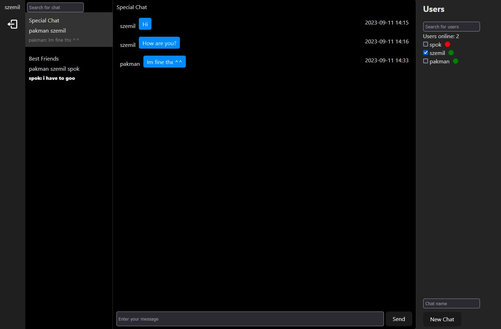

# Chat-App

Chat-App is a custom chat application designed for seamless communication with
friends and peers. This application allows users to register as unique
individuals, granting them access to the chat functionality. Users can choose
from a list of available members and create new conversations with them. With
the ability to manage multiple chat sessions simultaneously, Chat-App ensures a
dynamic and interactive chatting experience for all its users.

## Tech stack

- Frontend: TYPESCRIPT | REACT | REDUX | CSS-MODULES
- Backend: NodeJs | Express | Web-Sockets | SQL | MySQL | JWT

## Register/Login

## Chat

Enjoy!
